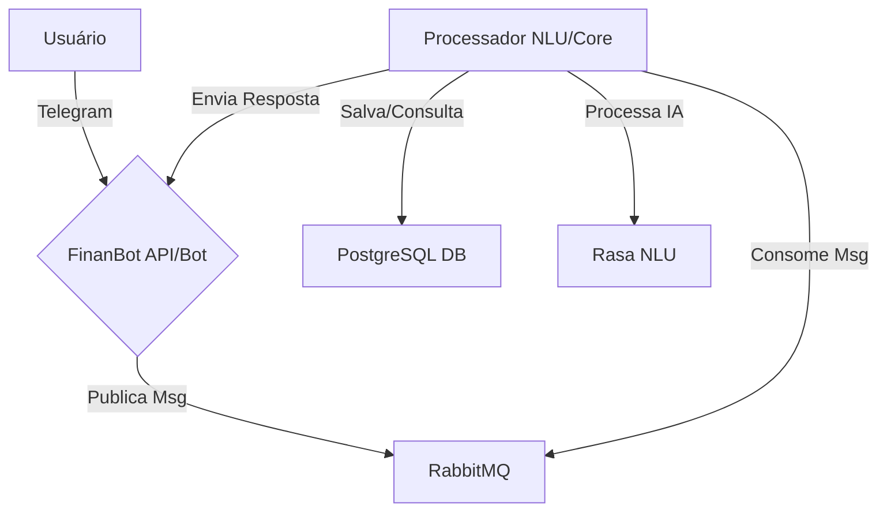

# FinanBot: Seu Co-piloto Financeiro Pessoal no Telegram

### Sumário

  * [Descrição do Projeto]
  * [Principais Funcionalidades]
  * [Stack Tecnológico]
  * [Arquitetura]
  * [Como Começar]
  * [Uso da API RESTful]
  * [Roteiro de Desenvolvimento (Roadmap)]
  * [Como Contribuir]
  * [Licença]

-----

### Descrição do Projeto

O **FinanBot** é uma plataforma completa de gerenciamento financeiro pessoal, projetada com uma API RESTful robusta como base e um bot inteligente no Telegram como a principal interface de usuário. Construído com **Spring Boot 3**, o projeto segue rigorosamente os princípios de **Arquitetura Limpa (Clean Architecture)**, **SOLID** e **Clean Code** para garantir uma base de código testável, escalável e de fácil manutenção.

O grande diferencial do FinanBot é sua capacidade de transformar a gestão financeira em uma experiência simples e conversacional. Através de um assistente proativo no Telegram, ele automatiza tarefas tediosas, oferece insights preditivos e conecta suas finanças aos seus objetivos de vida, atuando como um verdadeiro co-piloto para sua jornada financeira.

### Principais Funcionalidades

#### 🤖 Interação Inteligente via Telegram

  * **Registro Conversacional (NLU):** Adicione despesas e receitas usando linguagem natural. Ex: *"gastei 55,90 no almoço com o cartão do Itaú"*.
  * **Comandos e Teclados Interativos:** Use comandos (`/resumo`, `/metas`) e botões para uma navegação rápida e intuitiva.
  * **Alertas Proativos:** Receba notificações sobre o fechamento da fatura do cartão, proximidade de atingir um orçamento ou lembretes de contas a pagar.

#### ⚙️ Automação e Praticidade

  * **Leitor de QR Code de Nota Fiscal (NFC-e):** Envie a foto do QR Code de uma nota fiscal e o FinanBot extrai e registra a compra automaticamente.
  * **Detecção de Despesas Recorrentes:** O bot identifica assinaturas e contas mensais e sugere o cadastro automático.

#### 📈 Planejamento e Visão de Futuro

  * **Módulo de Metas:** Crie objetivos financeiros (ex: "Viagem", "Entrada do Apartamento"), defina prazos e valores, e acompanhe seu progresso.
  * **Previsão de Fluxo de Caixa:** Com base no seu histórico, o bot projeta seu saldo futuro para evitar surpresas no fim do mês.
  * **Orçamentos Inteligentes:** Defina orçamentos por categoria e receba insights sobre onde você pode economizar.

#### 👥 Finanças Colaborativas

  * **Gestão de Grupos ("Rachadinha Inteligente"):** Crie grupos para viagens ou eventos, registre despesas compartilhadas e o bot calcula quem deve quanto para quem ao final.

#### 📊 Visão 360° do Patrimônio

  * **Múltiplas Contas:** Gerencie diversas contas (corrente, poupança, carteira, cartões de crédito) em um só lugar.
  * **Consolidação de Investimentos:** Adicione seus ativos (Ações, FIIs, Cripto) e acompanhe a rentabilidade e a evolução do seu patrimônio total.

### Stack Tecnológico

| Categoria                | Tecnologia                                                              |
| ------------------------ | ----------------------------------------------------------------------- |
| **Linguagem & Framework** | Java 17, Spring Boot 3                                                  |
| **Banco de Dados** | PostgreSQL, Flyway (migrations)                                         |
| **Persistência** | Spring Data JPA, Hibernate                                              |
| **Autenticação & Segurança** | Spring Security, JSON Web Token (JWT)                                   |
| **Inteligência Artificial**| Rasa Open Source (para NLU, auto-hospedado)                             |
| **Mensageria Assíncrona** | RabbitMQ                                                                |
| **Testes** | JUnit 5, Mockito, MockMvc, Testcontainers                               |
| **Interface** | API de Bots do Telegram                                                 |
| **Documentação da API** | Springdoc OpenAPI (Swagger UI)                                          |
| **Ferramentas Auxiliares** | Maven, Lombok, MapStruct                                                |
| **Ambiente de Execução** | Docker, Docker Compose                                                  |

### Arquitetura

O projeto adota a **Arquitetura Limpa (Clean Architecture)**, garantindo a separação de responsabilidades e a independência de frameworks. A comunicação entre o bot e os serviços de processamento pesado (NLU, OCR) é feita de forma assíncrona via **RabbitMQ** para garantir resiliência e uma resposta rápida ao usuário.



### Como Começar

Siga os passos abaixo para executar a plataforma completa localmente.

#### 1\. Pré-requisitos

  * Java 17 JDK
  * Maven 3.8+
  * Docker e Docker Compose

#### 2\. Configuração

1.  **Clone o repositório:**
    ```bash
    git clone https://github.com/seu-usuario/finanbot.git
    cd finanbot
    ```
2.  **Configure as variáveis de ambiente:**
      * Renomeie o arquivo `.env.example` para `.env`.
      * Abra o arquivo `.env` e preencha as seguintes variáveis:
          * `DB_PASSWORD`: Senha para o banco de dados PostgreSQL.
          * `TELEGRAM_BOT_TOKEN`: Token do seu bot, obtido com o @BotFather no Telegram.
          * `TELEGRAM_BOT_USERNAME`: Username do seu bot.
          * `JWT_SECRET`: Uma chave secreta longa e segura para gerar os tokens JWT.

#### 3\. Executando com Docker Compose

O `docker-compose.yml` está configurado para orquestrar todos os contêineres necessários (Aplicação, Banco de Dados, Fila e NLU).

Execute o comando na raiz do projeto:

```bash
docker-compose up --build
```

A aplicação pode levar alguns minutos para iniciar todos os serviços pela primeira vez.

### Uso da API RESTful

Após a inicialização, a API RESTful estará disponível em `http://localhost:8080`.

A documentação interativa da API (Swagger UI), gerada pelo Springdoc, pode ser acessada em:
**[http://localhost:8080/swagger-ui.html](https://www.google.com/search?q=http://localhost:8080/swagger-ui.html)**

### Roteiro de Desenvolvimento (Roadmap)

#### ⭐ Melhoria Futura: Conexão com Open Finance

A integração com o Open Finance Brasil é a **visão de longo prazo** e o recurso mais poderoso do roadmap do FinanBot. Ele permitirá a importação e categorização automática de transações diretamente das suas contas bancárias.

> **Observação Importante:** Devido aos complexos requisitos regulatórios e de certificação de segurança exigidos pelo Banco Central, não é viável para uma pessoa física ou um projeto de código aberto lançar esta funcionalidade para o público geral em um ambiente de produção. A implementação atual está focada nos ambientes de **Sandbox** do Open Finance para desenvolvimento e prova de conceito.

### Como Contribuir

Contribuições são muito bem-vindas\! Se você tem ideias para novas funcionalidades, melhorias ou encontrou algum bug, sinta-se à vontade para abrir uma *Issue* ou um *Pull Request*.

1.  Faça um *Fork* do projeto.
2.  Crie uma nova *Branch* (`git checkout -b feature/sua-feature`).
3.  Faça o *Commit* das suas alterações (`git commit -m 'Adiciona sua-feature'`).
4.  Faça o *Push* para a *Branch* (`git push origin feature/sua-feature`).
5.  Abra um *Pull Request*.

### Licença

Este projeto está licenciado sob a Licença MIT. Veja o arquivo [LICENSE](https://www.google.com/search?q=LICENSE) para mais detalhes.
